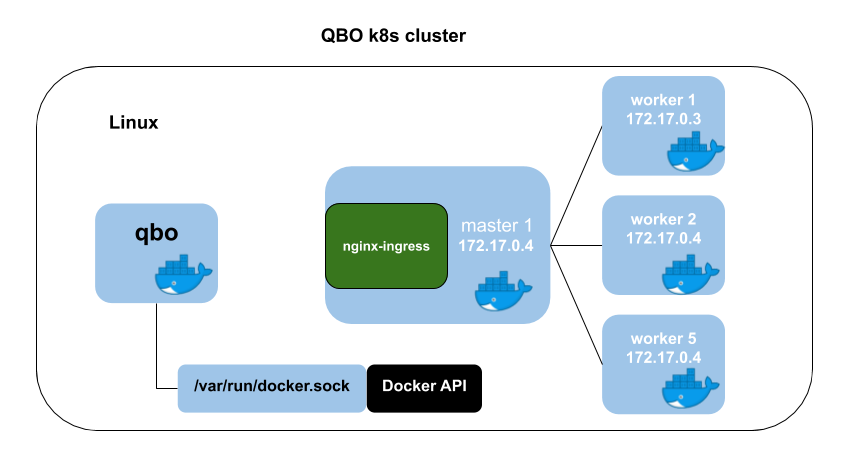

- [Description](#description)
- [Requirements](#requirements)
- [Linux or Mac Setup](#linux-or-mac-setup)
- [Get help menu](#get-help-menu)
- [Create a multinode Kubernetes cluster](#create-a-multinode-kubernetes-cluster)
  - [Linux](#linux)
  - [Mac](#mac)
- [Get Kubernetes cluster details](#get-kubernetes-cluster-details)
- [Add a worker node to the cluster](#add-a-worker-node-to-the-cluster)
- [Tests](#tests)
  - [Kubectl](#kubectl)
  - [Nginx ingress](#nginx-ingress)
  - [DNS](#dns)
  - [Registry](#registry)
- [Gitlab integration](#gitlab-integration)
- [Default ports](#default-ports)
- [Default configuration](#default-configuration)


# Description
 
`qbo` can deploy a multi-node Kubernetes cluster in docker without the need for virtual machines. Well, at least that's the case in Linux. In a Mac you are actually running inside LinuxKit when using Docker Desktop (See caveats and details below). `qbo` allows you to add and remove nodes as you see fit.
 
 
# Requirements
Install docker and add `$USER` to `docker` group.
 
`$ sudo usermod -aG docker $USER`
 
# Linux or Mac Setup
 
The following command will download `qbo`docker image, print the aliases and environment variables to run `qbo`.

> `qbo` runs as non-root.
 
```
$ sh qbo-env.sh 
latest: Pulling from eadem/qbo
Digest: sha256:8489bcf848ad92dbd5112eda1f4c82bcb1b8e123b9ac6d77ba67cefc679c40eb
Status: Image is up to date for eadem/qbo:latest
docker.io/eadem/qbo:latest


# -----BEGIN QBO CONFIG-----
# Run or add the lines below to ~/.bashrc
# qbo
alias qbo="docker run -t --user=1000:1001 -v /var/run/docker.sock:/var/run/docker.sock -v /home/alex/.qbo:/tmp/qbo eadem/qbo:latest qbo"
# kubeconfig
export KUBECONFIG=/home/alex/.qbo/admin.conf
# -----END QBO CONFIG-----
```
 
# Get help menu
 
```
$ qbo
version     Show version.
get         Get cluster, nodes or images.
delete      Delete a cluster or a node.
stop        Stop a cluster or a node.
start       Start a cluster or a node.
add         Add a cluster, a node or an image.
?           Synonym for 'help'
help        Show available subcommands
```
 
# Create a multinode Kubernetes cluster
 
Upon cluster creation, `qbo` will install Calico network, Nginx ingress and create GitLab credentials. See below for examples and Linux vs Mac differences on how to access the services.
 
## Linux
 

 
 
In Linux you'll have access to all the worker and master nodes running in containers via IP. Docker becomes the equivalent of your VM.
 
```
$ qbo add cluster -w2 -d eadem.com
[2020/06/23 04:19:50:8664] N:  master.eadem.com                              ready
[2020/06/23 04:20:39:8318] N:  worker-bf3a1c20.eadem.com                     ready
[2020/06/23 04:21:18:6250] N:  worker-b6144036.eadem.com                     ready
```
 
## Mac
Unfortunately in Mac, Docker is not running natively in the OS. Docker Desktop runs docker inside LinuxKit which is a light VM but still a VM. You'll need to expose the ports at cluster creation in order to access the containers & services. 
 
```
$ qbo add cluster -d`hostname` -p443 -p80 -p53/udp
[2020/06/23 20:25:29:7167] N:  master.sfo-ml-00048714                        ready
[2020/06/23 20:26:10:2546] N:  worker-0245e277.sfo-ml-00048714               ready

$ kubectl get nodes
NAME                              STATUS   ROLES    AGE   VERSION
master.sfo-ml-00048714            Ready    master   88s   v1.18.1-dirty
worker-0245e277.sfo-ml-00048714   Ready    <none>   25s   v1.18.1-dirty
```
 
> kubeconfig will be written under `$HOME/.qbo/`
 
# Get Kubernetes cluster details
```
$ qbo get nodes
e3b911261ec4 worker-b6144036.eadem.com                172.17.0.5         eadem/node:v1.18.1        running             
f6949a23213c worker-bf3a1c20.eadem.com                172.17.0.4         eadem/node:v1.18.1        running             
15ab3e4dee4a master.eadem.com                         172.17.0.3         eadem/node:v1.18.1        running  
```
```
$ qbo get cluster
qbo          172.17.0.3:6443
0.0.0.0:80->80/tcp
0.0.0.0:443->443/tcp
0.0.0.0:5000->5000/tcp
0.0.0.0:53->53/udp
0.0.0.0:6443->6443/tcp
```
 
# Add a worker node to the cluster
 
```
$ qbo add node
[2020/06/23 04:25:05:8896] N:  worker-724e848f.eadem.com                     ready
```
 
# Tests
 
## Kubectl
```
$ kubectl get nodes
NAME                        STATUS   ROLES    AGE     VERSION
master.eadem.com            Ready    master   6m16s   v1.18.1-dirty
worker-724e848f.eadem.com   Ready    <none>   48s     v1.18.1-dirty
worker-b6144036.eadem.com   Ready    <none>   4m35s   v1.18.1-dirty
worker-bf3a1c20.eadem.com   Ready    <none>   5m24s   v1.18.1-dirty
```
 
## Nginx ingress
```
$ kubectl apply -f foobar-ingress.yaml
$ curl -k https://localhost:443/foo
foo
$ curl -k localhost/bar
bar
```
 
## DNS
 
```
nslookup kube-dns.kube-system.svc.cluster.local localhost
Server:         localhost
Address:        ::1#53
 
Name:   kube-dns.kube-system.svc.cluster.local
Address: 10.96.0.10
```

## Registry
```
$ curl localhost:5000/v2/_catalog
{"repositories":[]}
```
# [Gitlab integration](gitlab.md)

# Default ports
 
Port | Service
-----|----------
5000 | registry
6443 | kube-api 
53 | kube-dns
443 | nginx-ingress
80 |niginx-ingress
 
# Default configuration
 
Option | value
-------|-------
--image | eadem/node:v1.18.1
--workers | 1
 
 
 
 
 
 
 
 
 

